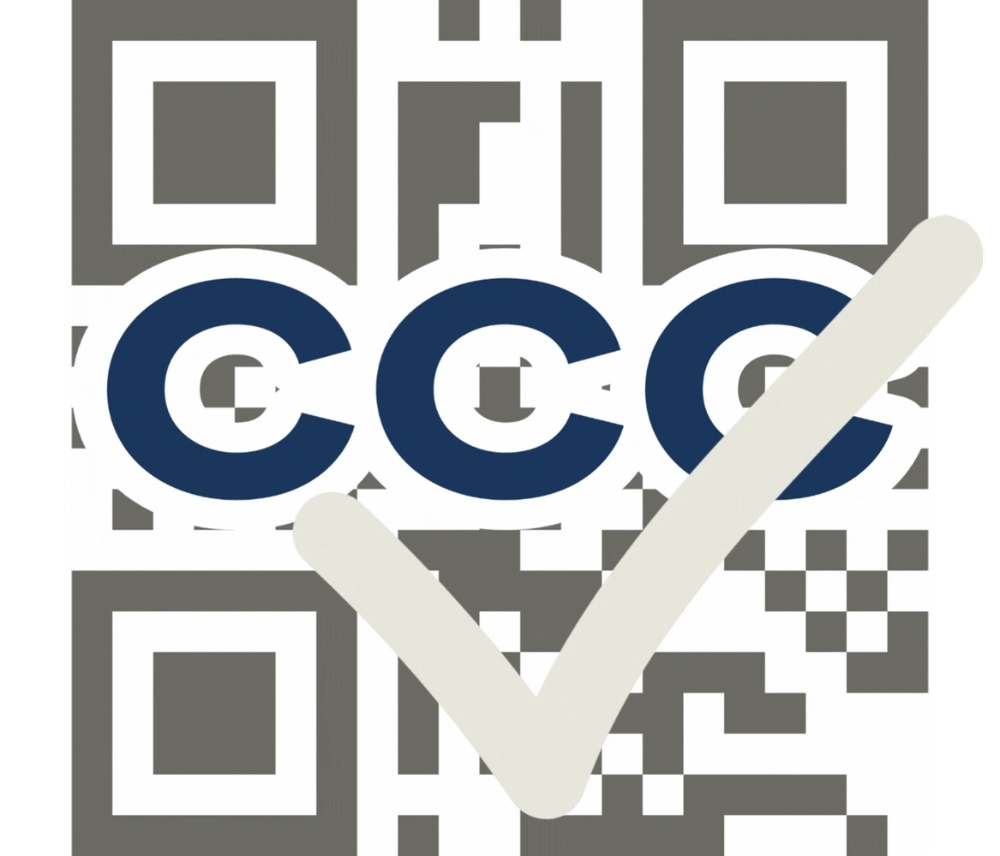

  
  <h1>CCC Attendance</h1>
  
<b>一个签到码，三步搞定</b>

  
  
  

  
  

## 严正声明

- 本程序是开源娱乐项目，严禁用于CCC代签
- 作者保留对非法使用本程序者追责的权利
- 学校官方/外包平台可通过Issues联系作者：若有侵权，会立即处理

## 使用方法

**访问 [https://ccc.byron.wang/](https://ccc.byron.wang/)**

## 常见问题

**Q：签到失败？**  
A：请确认：
   - 你处于`eduroam`/`UNNC-Living`等校园网或IT-Service提供的`UNNC_IPSec VPN`环境
   - 课程已经接近结束或结束不久
   - 链接复制完整
   - *也许这节课压根没有签到环节*

## 贡献代码

参考[CONTRIBUTING](CONTRIBUTING.md)。

## 开源协议

本项目采用MIT协议开源，详见[LICENSE](LICENSE)。